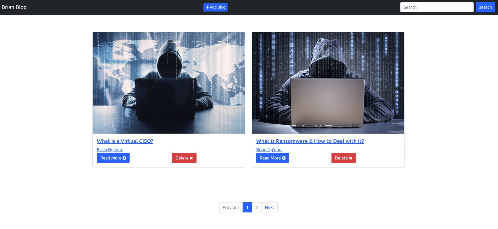
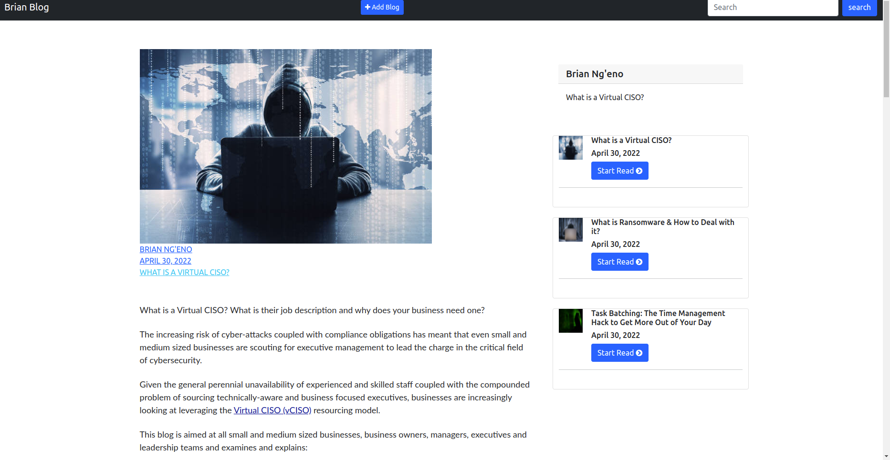

# MVC Model Blog Example

This is a web application for displaying Blogs that allows users to create, delete , update or delete a Blogs.

## User stories
```
+ User should upload a blog to the application.
+ User should see uploaded blogs in the site.
+ User should be able to delete blogs.
+ User should be able to update the exisiting blogs.
+ User should be able to add comments and reactions to the existing blogs.
```

## Project Design Preview
+ This is the landing page where we will see all our project blogs


+ The screenshot shows the page displayed on a single blog click



## Author

Brian Ng'eno <br>
Email: brian.ng'eno@moringaschool.com

## Technologies Used
To achive the desired outcome and meet all the objectives of this project, the following technologies were partially or fully used:
```
1. Django
2. HTML
3. CSS
4. Bootstrap 5
5. Javascript
6. JQuery
```

This project was created with [Django](https://docs.djangoproject.com/en/4.0/) version 2.2.0.

## Setup/Installation Requirements
* For a developer who wishes to view the work.You will have to clone my repository and check the ```requirements.txt``` to be able to get all the tools needed for proper running of the applictaion and also check the version of python used from the ```runtime``` to assert you fullfill requirements to run the application.

## Getting Started.
These instructions will get you a copy of the project up and running on a local host.

+ Git clone 
+ Enter the Project root folder cd MVC Explained/ install virtual environment (venv) without pip  ***python3.6 -m venv --without-pip env*** 
+ Activate virtual environment  ***source virtual/bin/activate*** install pip using curl
***curl https://bootstrap.pypa.io/get-pip.py | python***

+ Runnig the server ***python3.6 manage.py runserver***


## Known Bugs

There are no unresolved issues in regards to this code that I know of as of the last deployment.

## Prerequisites

To be able to run this web application, you will need to have a web browser, preferably ***Google Chrome*** or ***chromium***.
Just open the url link deployed on GitHub and run it.

## Technologies Used

I worked on this code on Linux OS. I used python as my primary language and django model to work on the Application. I worked on  the code using vs code,Git applications and heruko.

## Support and contact details

If there are any issues on how the code runs, concerns, questions or ideas, kindly reach out to me on my email address; 
brian.ng'eno@moringaschool.com.

## License

MIT License
```
Copyright (c) 2018 BrianNg'eno

Permission is hereby granted, free of charge, to any person obtaining a copy
of this software and associated documentation files (the "Software"), to deal
in the Software without restriction, including without limitation the rights
to use, copy, modify, merge, publish, distribute, sublicense, and/or sell
copies of the Software, and to permit persons to whom the Software is
furnished to do so, subject to the following conditions:

The above copyright notice and this permission notice shall be included in all
copies or substantial portions of the Software.

THE SOFTWARE IS PROVIDED "AS IS", WITHOUT WARRANTY OF ANY KIND, EXPRESS OR
IMPLIED, INCLUDING BUT NOT LIMITED TO THE WARRANTIES OF MERCHANTABILITY,
FITNESS FOR A PARTICULAR PURPOSE AND NONINFRINGEMENT. IN NO EVENT SHALL THE
AUTHORS OR COPYRIGHT HOLDERS BE LIABLE FOR ANY CLAIM, DAMAGES OR OTHER
LIABILITY, WHETHER IN AN ACTION OF CONTRACT, TORT OR OTHERWISE, ARISING FROM,
OUT OF OR IN CONNECTION WITH THE SOFTWARE OR THE USE OR OTHER DEALINGS IN THE
SOFTWARE.
Copyright (c) 2018 **Ngeno**